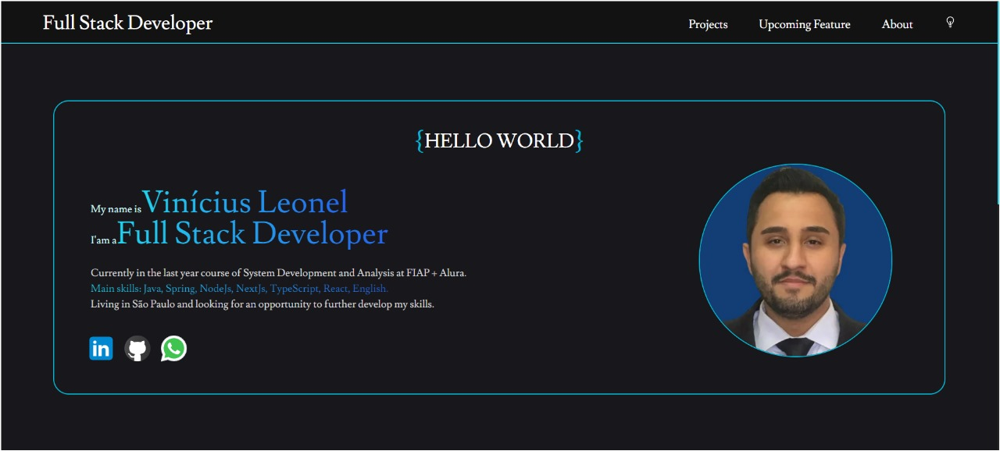

<h1 align="center"> Portfólio - Vinicius Leonel 

<!--[viniciusleonel.dev.com.br](https://viniciusleonel.dev.br/)-->

</h1>

<h2 align="center"> EM DESENVOLVIMENTO</h2>

---

## Descrição:

Este projeto é um portfólio pessoal desenvolvido para apresentar minhas habilidades e projetos. A aplicação foi construída utilizando as seguintes tecnologias:

- **Next.js**: Framework React para desenvolvimento de aplicações web modernas e otimizadas.
- **React**: Biblioteca JavaScript para construção de interfaces de usuário.
- **TypeScript**: Superset do JavaScript que adiciona tipagem estática ao código.
- **Tailwind CSS**: Framework CSS para estilização rápida e eficiente.

## Funcionalidades Principais:

- **Seção de Sobre**: Apresenta uma breve introdução sobre mim, minhas habilidades principais e links para minhas redes sociais.

- **Seção de Experiências**: Detalha minhas experiências em diferentes áreas de desenvolvimento, como Backend, Frontend, Mobile e Banco de Dados. Cada área possui uma descrição detalhada das tecnologias e projetos relacionados.

- **Seção de Projetos**: Apresenta uma lista de projetos desenvolvidos, com descrições, tecnologias utilizadas e links para o código fonte e demonstrações ao vivo.

- **Carrossel de Projetos**: Um carrossel interativo que permite navegar pelos projetos destacados.

## Instruções de Uso:

Para rodar a aplicação localmente, siga os passos abaixo:

1. Clone o repositório.
2. Instale as dependências com `npm install`, `yarn install` ou `pnpm install`.
3. Inicie o servidor de desenvolvimento com `npm run dev`, `yarn dev` ou `pnpm dev`.
4. Abra [http://localhost:3000](http://localhost:3000) no navegador para ver a aplicação.

## Links:

- [Portfólio Online](https://vinicius-leonel-viniciusleonels-projects.vercel.app/pt)
- [Repositório no GitHub](https://github.com/viniciusleonel/vinicius-leonel)
